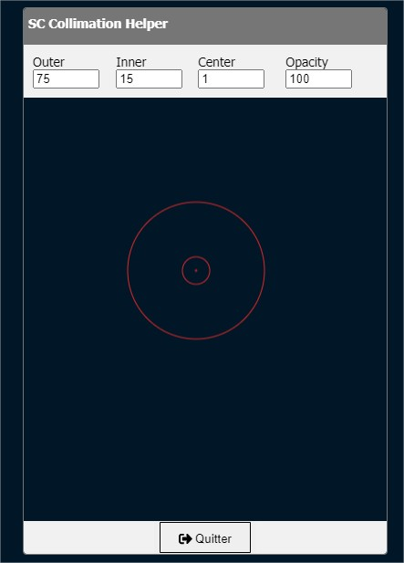

# SC Collimation Helper

Helper to collimate schmidt cassegrain telescope



# Features

- Show 3 concentric circles
- Change their diameter
- Change global opacity

# installation

```
yarn
```

# Lancement

```
yarn start
```